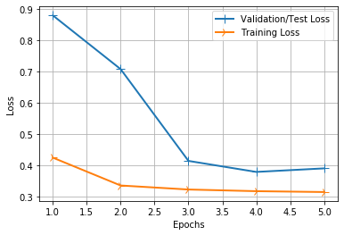
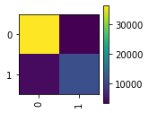
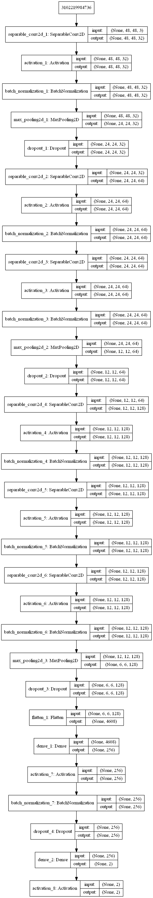

# Breast-Cancer-Detection-with-Deep-Learning
Breast cancer is the most common form of cancer in women. Accurately identifying and categorizing breast cancer subtypes is an important clinical task, and automated methods can be used to save time and reduce error. The model gives correct results with 86% accuracy.

Downloaded Dataset from https://www.kaggle.com/paultimothymooney/breast-histopathology-images/version/1

We are using CNN to classify between cancerous cells and non-cancerous cells.




```
Confusion Matrix
[[36257  3412]
 [ 4370 11466]]

Classification Report
              precision    recall  f1-score   support

           0       0.89      0.91      0.90     39669
           1       0.77      0.72      0.75     15836

    accuracy                           0.86     55505
   macro avg       0.83      0.82      0.82     55505
weighted avg       0.86      0.86      0.86     55505
```


